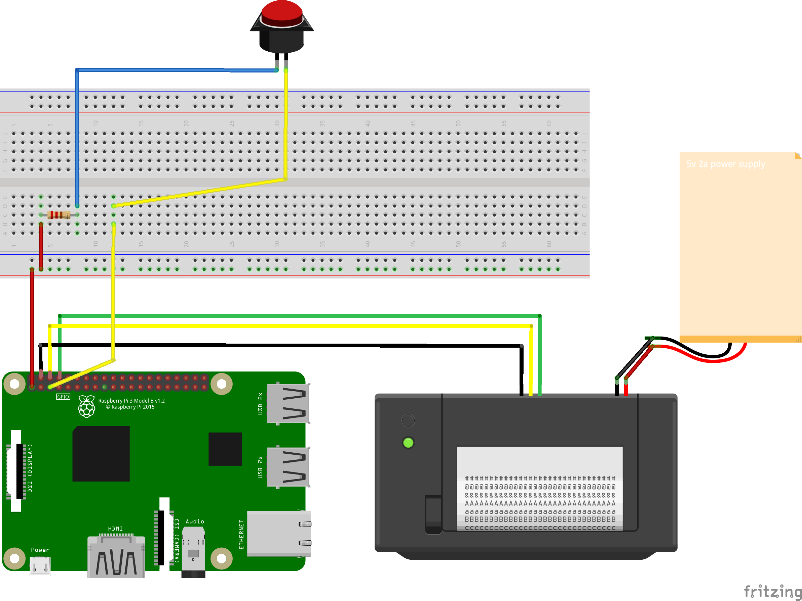

# Run
```
python3 -m venv env
python3 -m pip install requests
python3 -m pip install todoist-python 
```

# Add your own API token
First copy over the example file to the correct location
```
$ cp lib/example_secrets.py lib/secrets.py
```
Then go ahead and add your own token to the file lib/secrets.py
N.B. This file is automatically .gitignored so it shouldn't get added,
however be extra careful to never share your token in git!


* Note the power supply is a [5v 2A power supply](https://www.adafruit.com/product/276)

# TODOS:
- [x] add requirements.txt
- [x] add secrets.py and ignore it
- [x] set up any kind of modules/lib environment
- [x] separate lib file to get the string from
